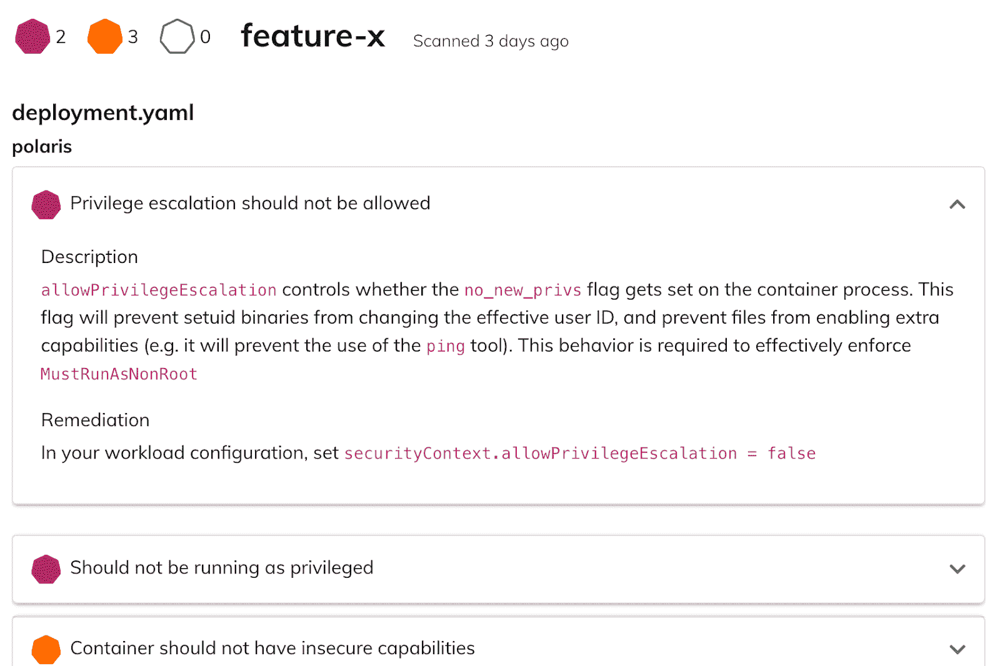
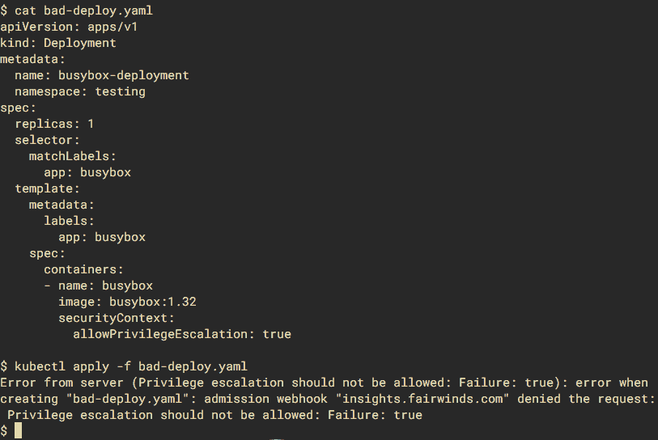

# Fairwinds Insights: CI 渠道保护您的 Kubernetes 集群

> 原文：[https://www.fairwinds.com/blog/fairwinds-insights-continuous-integration-pipeline-to-protect-your-kubernetes-clusters#2022-12-08](https://www.fairwinds.com/blog/fairwinds-insights-continuous-integration-pipeline-to-protect-your-kubernetes-clusters#2022-12-08)

 大约一年前，我们建造了[fair winds Insights](https://www.fairwinds.com/insights)来让我们的生活更轻松。我们管理着数十个组织的数百个集群，需要一种方法来跟踪这些集群在安全性、效率和可靠性方面的健康程度。因此，我们构建了一个平台来运行不同的 Kubernetes 审计工具，并将结果汇总到一个单一的仪表板中。

鸟瞰我们的集群的健康状况让我们——以及越来越多的客户——获得了自信地运行 Kubernetes 所需的可见性。每当有新的内容需要审计时，它就能够轻松地添加新的报告类型。

但是我们的客户很快指出，洞察力只能在错误发生后*捕捉错误！因为它只能分析正在运行的集群，所以它发现的任何问题都已经在影响生产。*

理想情况下，我们应该能够在过程的早期发现这些问题，并阻止它们到达一个活动的集群。因此，我们建立了两种新的方式来运行 Fairwinds Insights:持续集成管道，可以在同行评审期间发现 [基础设施代码](https://www.fairwinds.com/blog/why-infrastructure-as-code-kubernetes) 中的问题，以及准入控制器，可以防止有问题的资源进入集群。

## **Fairwinds 对持续集成的见解**

捕捉安全漏洞和其他问题的最佳时机是在同行评审中，在它们进入代码库的主要分支之前。当人们编辑 Dockerfiles 和 Kubernetes 清单时，他们可能会无意中安装易受攻击的软件，引入安全缺陷，或者忽略关键的配置部分，如资源请求或健康探测。

其中一些问题可以通过经验丰富的 Kubernetes 专家对代码的彻底检查来发现，但是这个过程可能会很繁琐并且容易出错。Fairwinds Insights 的 CI 集成自动化了许多最重要的检查，以帮助评审人员快速发现问题。

可以对 Insights 进行配置，以便在引入新问题时显示警告，或者只要问题存在，就阻止开发人员合并他们的更改。

当发现问题时，开发人员可以访问 Fairwinds Insights，了解更多关于问题是什么，以及如何解决这些问题的信息:

目前，Insights 能够使用 [北极星](https://github.com/FairwindsOps/polaris) 检查 Kubernetes 清单的配置问题，以及使用 [Trivy](https://github.com/aquasecurity/trivy) 扫描已知 CVE 的 Docker 图像。在不久的将来，我们将添加对使用 OPA 构建 [自定义配置策略的支持，以及使用](https://insights.docs.fairwinds.com/reports/opa/) [Pluto](https://github.com/FairwindsOps/pluto) 检测废弃资源的支持。

当然，并不是集群中的每个资源都要经历一个 CI 过程——有些是由 Kubernetes 控制器自动创建的，有时工程师会使用 kubectl 和 Helm 手动创建或编辑资源。这就是为什么有一个准入控制器是重要的。

## **洞察准入控制器**

理想情况下，集群中的一切都可以追溯到版本控制的 [基础设施即代码](https://www.fairwinds.com/blog/why-infrastructure-as-code-kubernetes) (IaC)。利用 IaC 的团队可以更轻松地审计变更、回滚错误，并了解他们的集群中正在运行什么。

但是总有办法让东西不经过 IaC 审查就进入你的集群。有时你需要热修复，或者一个工程师不小心在错误的上下文中运行了 kubectl apply 。因此，除了 CI 检查之外，有一个后备机制来防止安全性、效率和可靠性问题进入您的集群也是至关重要的。准入控制器是这里的 Kubernetes-native 解决方案。

每当有新资源添加到集群中时，Fairwinds Insights 准入控制器就会运行。如果资源违反了您组织的策略，准入控制器将拒绝它，并通知客户端(通常是运行 kubectl 或 helm 的开发人员)他们需要更改什么。

Fairwinds Insights 允许您从一个集中的位置控制每个集群中的准入控制器。如果您想实施一个新的策略，或者创建一个豁免，您只需要接触一个系统，您的更改就会自动联合到各处。您还可以为某些集群配置独特的策略，例如，如果您希望在生产和转移方面更加严格。

## **左移**

当然，Fairwinds Insights 仍然出色地扫描了 Kubernetes 集群中当前运行的所有内容，以发现存在的问题，这将始终是您的基础架构有多安全、高效和可靠的最真实的视图。但是，通过将问题转移到 CI 管道和准入控制中，我们能够在问题进入集群之前预防问题。

> 您可以永远免费使用 Fairwinds Insights。拿过来[这里](/coming-soon)。

此外，Fairwinds Insights 能够在您的机群中的每个集群上应用从 CI 到准入到生产的相同策略(或它们的变体)。这样，每个人都遵循相同的标准，并且这些标准在整个开发周期中被一致地应用。

借助新的 CI 和准入控制器功能，运营团队可以高枕无忧，因为他们知道一旦他们的集群进入良好状态，Fairwinds Insights 将确保他们保持这种状态。

## **资源**

