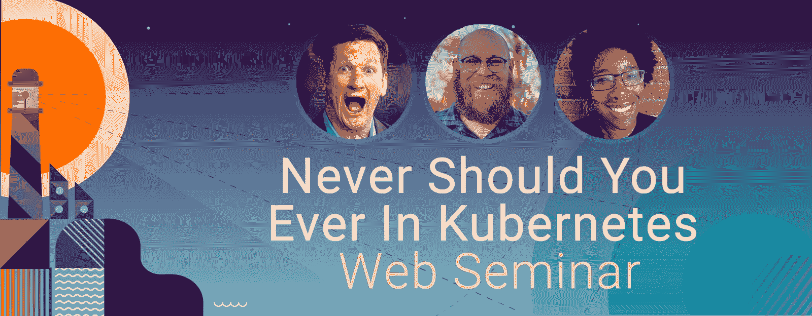

# 永远不要在库伯内特斯:#1 做 k8 的艰苦方式

> 原文：[https://www.fairwinds.com/blog/never-should-you-ever-in-kubernetes-1-do-k8s-the-hard-way#2021-04-12](https://www.fairwinds.com/blog/never-should-you-ever-in-kubernetes-1-do-k8s-the-hard-way#2021-04-12)

 不管你是 Kubernetes 新手还是有经验，有些事情你绝对不应该在 Kubernetes 做。【Corey Quinn】云中尖叫创始人兼鸭嘴集团首席云经济学家，与 Fairwinds 总裁 Kendall Miller 和 Fairwinds 高级站点可靠性工程师 Stevie Caldwell 一起讨论开发和运营团队如果想充分利用领先的容器编制器，就不应该在 Kubernetes 中做什么。这里有一些 Kubernetes 的基本技巧，让你开始。

(请记住，这是你永远不应该做的事情，所以对某些人来说，标题可能有点不对！)

## (为您的生产基础架构)做好 K8s

许多站点可靠性工程师绝对吃过 Kubernetes 的亏——从头开始学习如何设置和运行 Kubernetes 环境。不可否认，这可能是一个非常有趣的旅程，你会学到很多东西。知道幕后发生了什么是很好的，所以当你遇到复杂的问题时，你会有一些关于如何处理它们的想法。所以作为一个学习的过程，它是非常有价值的。

然而，当你试图快速启动并运行时，从一些基础开始，并从已经学会如何构建可重复框架的人 那里获得帮助和 [建议，真的很有帮助。大多数公司都面临着同样的基础设施问题，因此，虽然你可能会学到很多东西，试图自己找出 Kubernetes 中所有的移动部分，但要找出你需要跟踪和管理的所有东西可能有点令人难以置信。艰难地学习 Kubernetes 对学习来说很好，但你可能希望你的生产基础设施建立在更健壮的东西上。](https://www.fairwinds.com/clusterops)

## 假设 Kubernetes 适合您的简单博客

如果你一直在旋转和关闭集群，也许在 Kubernetes 上写博客并不觉得多余。但即使在那种情况下，这也是一种延伸。当你学习像 Kubernetes 这样的东西时，你可能想在 Kubernetes 上运行一个“hello world”博客，作为你培训过程的一部分，因为大多数人很容易理解博客的目的和功能。从各种地方抓取一个博客应用程序并试用它是很容易的。当人们认为他们应该在 Kubernetes 上运行他们的博客时，问题就来了。

问问你自己，为什么要用非常复杂的东西来代替本质上非常简单的东西？以下是你可能不想在简单的博客中使用 K8s 的几个原因:

1.  运行生产级 Kubernetes 集群的复杂性与成本不相称，成本可能会高得多。

2.  为了获得最大的正常运行时间，您需要运行高可用性集群，这进一步增加了部署的复杂性。

3.  为了一些容易以另一种方式运行的东西，不值得花费脑力去解决不正常的事情。

如果你在问自己，我应该自己建造这个吗？我应该在本地托管 WordPress 吗？我应该建立一个 Kubernetes 集群吗？答案是:可以，但不需要。选择你的战斗，保存你的能量以备不时之需。

## 将控制平面作为定点实例运行

你的主节点，主要是 etcd 组件，是你不想在没有你控制的情况下消失的东西。如果您的控制平面节点消失，您的工作负载仍将运行，这没什么，但您需要考虑仲裁。如果你以某种方式手动操作你的控制平面，在一些节点退出后重新启动 etcd 是一个非常痛苦的手动过程。

AWS 上的 Spot 实例或其他提供者上的抢占式实例实际上是未使用的容量，其成本要低得多，但它可以随时被取走。如果你能正确地平衡它，你可以节省大量的钱，而且在大多数情况下，你的网站还能保持运行。在 Kubernetes 环境中，控制平面在您的节点帐户中所占的比例并不大。所以，你为了节省一点控制面板的费用而遇到的麻烦是不值得的。当它坏了，需要有人来修理的时候，你可能会毁了某人的一天(或一夜)。

## 在控制平面上运行工作负载

基本上，在控制平面上运行核心服务不是好的做法。您不希望在负责保持集群运行的节点上运行资源密集型 pod。如果您的资源在控制平面上失去控制，这将真正影响您的部署。您希望保持控制平面的稳定，并将需要大量资源的工作负载分开。

观看整个网上研讨会点播 [了解你在 Kubernetes](https://www.fairwinds.com/never) 还应该做什么。

