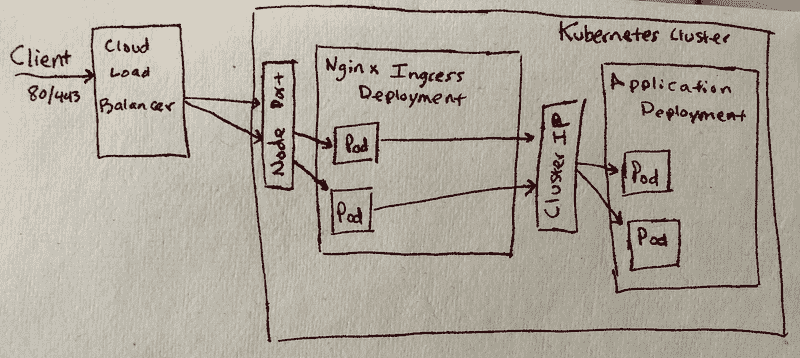

# 让 Kubernetes 全面投入运营

> 原文：[https://www.fairwinds.com/blog/making-kubernetes-fully-operational#2022-12-12](https://www.fairwinds.com/blog/making-kubernetes-fully-operational#2022-12-12)

 Kubernetes 集群是一个强大的工具。它使您能够部署容器化的工作负载，自动扩展它们，并在多台机器上调度它们。它甚至可以为您的服务打开一个负载平衡器，让您的服务向外界公开(假设您运行在一个受支持的云中)。不幸的是，所有这些功能都不是现成的。您需要 DNS 条目、基于路径的路由、TLS 证书、度量、扩展和基于角色的访问控制(RBAC)。随着时间的推移，在 Fairwinds，我们开发了一套工具，在每个集群中运行，提供各种服务。我们的最终目标是，任何应用程序都可以在集群中运行，拥有可读的地址和 TLS 证书，能够自动扩展，能够利用基于路径的路由，并且只拥有所需的访问权限。这不是一个简单的壮举，一路上有很多潜在的陷阱。本文应该作为一个指南，让一个裸的 Kubernetes 集群“完全可操作”。

免责声明:这是一个中级指南。它假设您有一个正在工作的 Kubernetes 集群，并且了解大多数基本的 Kubernetes 原语。

#### 初始设置

本指南主要包括在集群中安装工具和控制器。在 [Fairwinds](/) 我们使用 [Helm](https://github.com/helm/helm) ，一个 Kubernetes 包管理器，来安装我们使用的大多数(或全部)各种工具。为了使用舵，你必须在集群中安装舵杆。这可以使用 Helm cli 通过 tiller 的专用服务帐户来完成，如下所示:

除了 Helm，本指南还将参考 Kubernetes 部署。如果您正在阅读本文，您已经知道什么是部署和 pod。为了便于遵循指南，我将使用一个简单的 Nginx pod 的以下部署，并在其上进行构建:

#### 获取服务流量

让我们来讨论一下我们如何将流量从集群外部传输到集群内部运行的服务。Kubernetes 允许我们以几种不同的方式来实现这一点，我们应该首先探索这些方式。

**节点端口服务**

NodePort 服务就像它听起来的那样:它在所有节点上打开一个端口，用于将流量路由到 Kubernetes 服务。yaml 中的是这样定义[的:](https://kubernetes.io/docs/concepts/services-networking/#nodeport)

最终看起来是这样的:

注意，我们有一个内部集群 IP，端口被定义为`80:32732`。这表明当我们试图到达端口 32732 上的任何节点时，我们将被重定向到端口 80 上的服务。这是一个有用的构造，但它实际上只为外部负载平衡器打开了路由流量的大门。你不想让你所有的客户在我们的网址末尾输入 32732。

**负载平衡器服务**

在受支持的云提供商中，负载平衡器服务非常棒。它在集群中的所有节点上公开一个高端口，然后创建一个云负载平衡器，使用该端口来路由流量。[服务定义](https://kubernetes.io/docs/concepts/services-networking/#loadbalancer)非常简单:

这将在您的云提供商中创建一个云负载平衡器，并将其连接到它创建的端口。如果我们现在看看这项服务，我们会发现一些有趣的事情:

首先，我们看到有一个标记为`<pending>`的外部 IP 地址，因为我们的云提供商仍在创建资源。其次，我们看到为服务列出的端口是`80:32732`。这表明服务已经公开了一个节点端口，该节点端口将用作负载平衡器的侦听器端口。

LoadBalancer 服务功能强大，可通过云提供商特定的注释进行高度配置，但它们有一些限制。最大的问题是，您公开的每个服务都会创建一个单独的负载平衡器。在一个有数十或数百个微服务的世界里，这就增加了大量的云负载平衡器。负载平衡器服务也没有为基于路径的路由提供机会。同样，在微服务(甚至是常规服务)的世界里，这可能是行不通的。

**入口**

鉴于 NodePort 和 LoadBalancer 服务的局限性，我们需要更强大的服务。Kubernetes 开发人员预见到了这种需求，并创建了 Ingress 对象。入侵要求您在集群中运行一个控制器来处理它们，并且一开始就运行它们有点困难，但是回报是巨大的。

如前所述，为了使用入口，我们需要一个控制器。外面有好几个控制者，比如[孔](https://konghq.com/blog/kubernetes-ingress-controller-for-kong/)和[哈普洛克西](https://www.haproxy.com/blog/haproxy_ingress_controller_for_kubernetes/)。在 [Fairwinds](/) ，我们发现 [ingress-nginx，一种基于 nginx 的控制器，](https://github.com/kubernetes/ingress-nginx)是最容易使用的，也是最完整的解决方案之一。有许多方法可以安装它，但我们更喜欢使用[头盔](https://helm.sh/):

这将创建 Nginx 控制器，并使用现在熟悉的 LoadBalancer 服务公开它:

该服务指向一组运行 Nginx 的控制器单元。现在，我们可以在 Kubernetes 中创建名为 Ingresses 的对象，该对象将配置 Nginx 将流量路由到集群内部的服务。

您部署的每个需要在集群外部公开的服务现在都将包含一个入口定义。入口定义也非常简单，类似于下面的代码片段:

请注意，它路由到我们创建的服务。这告诉 Nginx，当流量以匹配的主机名进入集群时，将流量路由到该服务。这就是我们如何获得基于路径和名称的路由。如果我们深入研究入口控制器盒，查看 Nginx 的配置，我们会看到一个非常熟悉的 Nginx 服务器模块，它对应于我们的新入口。

像 LoadBalancer 服务一样，Ingresses 可以使用注释合并非常详细的配置。这些注释是 Nginx 特有的，可以在控制器中配置不同的选项。

所有这些意味着我们现在有办法在一个 Nginx 代理(或一组代理)后面运行数十或数百个服务，并且这些代理是使用易于部署的 Kubernetes 对象配置的。我们甚至可以用它来创建 TLS 证书和 DNS，我们将在后面看到。现在，我们有一个单一的云负载平衡器来处理到控制器的 TCP 流量，并且我们从集群内部处理路由。这里有一个小图表来把所有这些联系在一起:

Ingress Traffic Diagram

#### DNS 条目创建

因为我们使用基于路径和名称的路由，所以我们需要创建 DNS 条目。本着使用控制器和其他 Kubernetes 本地构造的精神， [Fairwinds](/) 使用了一个名为[外部 dns](https://github.com/kubernetes-incubator/external-dns) 的项目。该控制器将监视注释和某些类型的对象，并基于它们创建 DNS 条目。它还配有头盔:

*请注意，还需要指定您的 DNS 提供商的凭证，这取决于您正在使用的 DNS 提供商。详见* *此处* *。*

现在，当我们使用 dns 名称创建入口时，外部 DNS 控制器将使用入口控制器的 IP 地址更新我们的 DNS 提供商。

#### 使用 TLS 加密服务

既然我们的服务有了 HTTP 流量和容易访问的名称，我们想保护它们。HTTPS 已经成为事实上的标准，因为搜索引擎已经为它进行了优化，如果它不在那里，浏览器会给出难看的警告。传统上，这一直是运营团队的痛点。当时，我们必须生成证书并进行验证(有时通过手动门户)，然后仍然必须部署证书。根据应用程序的不同，我们必须更新应用程序代码或重启 web 服务器。在现代，我们有几种不同的选择。

**云提供商证书存储**

亚马逊提供亚马逊证书管理器(ACM)。结合负载平衡器服务和特殊注释，我们可以利用 ACM 证书在 TLS 到达集群之前终止它。如果您使用 Route53 DNS 生成证书，ACM 会自动续订证书。以类似的方式，入口控制器可以将通配符 ACM 证书与其负载平衡器合并。这意味着我们创建的任何在通配符中使用域的入口都可以免费获得 TLS。只要您习惯使用通配符，这对于少数服务来说是一个好的选择。一些安全策略不允许这样做，有时您需要不止一个子域。对于另一个自动验证选项，我们看得更远。

**让我们加密**

随着云计算和隐私问题的兴起， [Let's Encrypt](https://letsencrypt.org/about/) 着手创建一个任何人都可以免费使用的全自动认证机构。它们有一个特定的协议，允许您以编程方式自动验证和生成证书。该协议的许多实现已经完成，但我们在 [Fairwinds](/) 专注于 [cert-manager](https://github.com/jetstack/cert-manager) 。这个工具利用 Kubernetes 内部的一个定制控制器来请求和维护来自 Let's Encrypt 的证书。这与监视新的入口对象并自动为它们生成证书的 shim 相结合。

这意味着您可以部署 cert-manager，再也不用担心 TLS 证书了。当然，它比这要复杂一点，但是一旦部署，它可以无缝地管理证书。

为了部署 cert-manager，我们再次使用 Helm:

一旦控制器开始运行，还有几个部分需要设置。有两种方法可以对证书进行域验证。我们倾向于在[顺风](/)时尽可能使用 DNS01。为此，您的群集节点(或证书管理器)必须有权修改 DNS 提供商的记录。这超出了本文的范围，但是可以通过云提供商中的节点角色来完成。另一个选项是创建一个服务帐户，您将在下面的步骤中使用它。

接下来，您将创建一个 Issuer 或 ClusterIssuer，它负责配置您的 Let's Encrypt 帐户并设置您将使用的验证方法。在本指南中，我将使用 ClusterIssuer 并将其连接到 Let's Encrypt。这是通过创建另一个 Kubernetes 资源来实现的:

这里发生了一些事情:

1.  它使用谷歌云域名系统进行验证
2.  它使用服务帐户获取更新 DNS 的权限。服务帐户凭证存储在一个名为`dns-gcloud-config`的秘密中
3.  该电子邮件地址将成为您的加密帐户名称。续订电子邮件警告将放在这里
4.  这指向加密生产端点，因此它将生成有效的证书

一旦您应用此资源，证书管理器控制器将尝试设置您的加密帐户。如果你做了一个`kubectl describe clusterissuer letsencrypt-prod`，你会在输出的底部看到这样几行，表明你的账户已经注册:

现在您有了一个颁发者，我们有了入口控制器，我们可以重新部署我们的入口对象来利用 cert-manager:

请注意，除了入口底部的 TLS 块之外，注释还指定了 ssl 重定向和要使用的 ClusterIssuer。还指定了一个秘密名称，cert-manager 将使用它作为证书的名称。我们可以验证所有这些都是这样创建的:

现在，我们有了一个功能性入口，自动 TLS 加密将流量路由到我们的集群。为了在 Kubernetes 提供完全可操作的服务，这就留下了一个难题。

#### 使用指标扩展应用程序

我将把可扩展性和指标放在一起，因为如果没有某种可扩展的指标，我们就无法扩展应用程序，而且它们可以快速轻松地一起配置。Kubernetes 有一个内置机制，称为水平 pod 自动缩放器，可用于根据指标维护部署中的副本数量。为了做到这一点，我们必须向 Kubernetes API 公开指标。除非您在 GKE 上，这将自动为您提供，否则获取指标的最简单方法是将指标服务器部署到集群中。使用 Helm 非常简单:

一旦控制器启动并且填充了指标，我们应该能够看到 pod 和节点的资源利用率，如下所示:

有了度量标准，我们可以为我们的部署创建一个[水平机架自动缩放器](https://kubernetes.io/docs/tasks/run-application/horizontal-pod-autoscale/) (HPA)。HPA 被定义为另一个对象，如下所示:

几分钟后，您可以查看 HPA 并了解当前状态:

此设置将监视单元的 CPU 使用情况，并根据部署中设置的 CPU 限制(请参见原始部署)尝试将它们的利用率保持在 80%或以下。如果利用率过高，HPA 将扩大，如果利用率下降一段时间，它将缩小。这种行为可以通过自定义指标提供者更改为使用任何指标。对此进行正确的调整将允许您的部署处理许多不同的流量和负载问题。

#### 扩展集群

水平扩展 pod 很好，并允许动态流量处理，但它不能控制群集中有多少节点。随着我们添加越来越多的单元，我们将需要更多的节点来处理所有单元。当你看到一堆豆荚处于`Pending`状态时，这一点会变得很明显；当您执行`kubectl describe pod <pod-name>`时，您会看到一条关于无法安排 pod 的消息。我们通过利用集群自动伸缩来处理这个问题。如果无法安排新的 pods，集群自动缩放项目将扩大规模，它将密切关注节点利用率，如果发现机会，将缩小规模。

根据您使用的云提供商的不同，安装看起来会有很大的不同，但是我将简要介绍 AWS 和 GKE 安装。

**GKE**

这个真的很简单。如果您在节点池中打开自动缩放，默认情况下，GKE 会运行群集自动缩放。您可以在控制台中完成此操作，或者使用您用来设置集群的任何代码:

GKE Node Pool Autoscaling Menu

**AWS**

这再次取决于你如何创建你的集群，但是在[顺风](/)我们使用 [kops](https://github.com/kubernetes/kops) 。无论您如何构建集群(不包括 EKS)，您仍然需要安装[集群自动缩放器](https://github.com/kubernetes/autoscaler/tree/master/cluster-autoscaler)。我们使用 Helm 通过自动发现节点来安装自动缩放器。

这需要修改 kops 集群和实例组定义。这超出了本文的范围，但是这里有很好的记录。

#### 权限— RBAC

在 Kubernetes 中管理 RBAC(基于角色的访问控制)是困难的。您构建的集群很可能默认启用了它，而您可能根本没有配置它。本教程已经在我们部署的舵图中使用了 RBAC。

开箱即用，您可以定义许多资源:

*   服务帐户
*   clusterrolebindings
*   角色绑定
*   角色
*   集群角色

保持这些直线是令人困惑的，修改权限通常需要多组定义。 [Fairwinds](/) 利用了一个我们编写的控制器来简化它，这个控制器叫做 [rbac-manager](https://github.com/reactiveops/rbac-manager) 。我们可以用(你猜对了)Helm 安装它:

我们现在可以创建一个名为 rbacdefinition 的对象来管理我们的权限和服务帐户。让我们继续创建一个供我们的 CI/CD 系统使用:

应用它将创建一个名为`ci`的服务帐户，并将其绑定到集群角色`cluster-admin`。将来，我们可以使用该服务帐户为 ci 系统生成一个 kubeconfig 文件。接下来，我们可以添加这一功能，以便更好地控制群集中用户和服务帐户的所有权限。

#### 那已经很多了

您刚刚在集群中安装了大量工具，并添加了许多功能。我们刚刚加了什么？

*   入口控制器—用于路由和 TLS 终端进入集群
*   外部 DNS —管理您的入口的 DNS 记录
*   证书管理器—为入口生成和维护 TLS 证书
*   度量服务器—支持使用水平 Pod 自动缩放器
*   集群自动缩放—用于基于 pod 管理集群大小
*   RBAC 管理器—用于管理您的集群权限

所有这些都需要一个或多个舵图表来安装，并且可能需要不同的值，这取决于您想要进行的定制。运行这些命令并维护这些值文件可能会令人沮丧，尤其是在管理多个集群的情况下。Fairwinds 利用一个名为 [Autohelm](https://github.com/reactiveops/autohelm) 的自制工具来管理所有这些图表。它允许您维护一个文件来定义您想要使用的所有图表。在 [examples.md](https://github.com/reactiveops/autohelm/blob/master/examples.md) 中有所有不同图表的例子。

#### 一些责任重大的事情

现在，您拥有了“完全运行”的 Kubernetes 集群的强大功能。向前迈进，部署自动扩展、高可用性和 TLS 加密的服务。请给我打电话 [@sudermanjr](https://twitter.com/SudermanJr) 对未来的话题提出意见或要求。