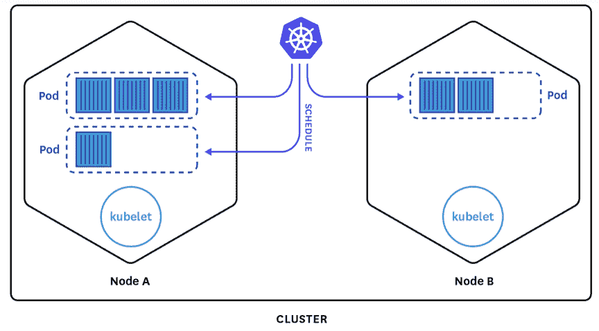

# Kubernetes 入门:架构基础和定义

> 原文：[https://www.fairwinds.com/blog/getting-started-with-kubernetes-architecture-basics-definitions#2020-05-11](https://www.fairwinds.com/blog/getting-started-with-kubernetes-architecture-basics-definitions#2020-05-11)

 本系列面向刚接触库伯内特和 GKE 的工程师。它提供了 Kubernetes 的[基本概述、定义以及在 GKE 构建](/blog/what-problems-does-kubernetes-solve) [*Kubernetes 集群*](https://www.fairwinds.com/blog/how-to-build-a-kubernetes-cluster-in-gke) *和您的第一个* [*多层 webapp*](https://www.fairwinds.com/blog/how-to-deploy-multi-tiered-web-application-with-kubernetes) *的快速入门。如果您正在寻找更深入的帮助，请联系。*

Kubernetes 入门需要一些基础的架构理解。在这里，我们总结了主节点和工作节点、Kubernetes 架构以及 pod、标签、选择器、部署和服务的定义。

## **主节点和工作节点**

有两种主要类型的机器——主机和工作机——都被称为节点。大多数情况下，当有人提到一个节点时，他们谈论的是一个工作者节点。

主节点做一些事情:

*   **服务 Kubernetes API**——无论何时你发出一个 kubectl 命令，你都是在直接和其中一个主人对话。Masters 通常以三个为一组运行，因此如果您丢失一个，您不会有停机时间。
*   **管理调度工作负载**——Kubernetes 提供了一种声明式的方法，将工作提交给 API，以便在 worker 节点上进行调度。主节点通过寻找具有足够资源的工作节点来处理这种调度，并告知工作是否可以被调度。
*   **保持工人的状态** -当工作被提交并且可以被调度或不被调度时，该“状态”由主保持。

请注意，如果您使用的是 GKE、EKS、AKS 或其他托管的 Kubernetes 服务，您就不需要担心运行主节点。

你可能也听说过 Kubernetes 的“控制飞机”。这包括主节点，以及运行在 worker 节点上的 kubelet 进程。控制平面:

*   维护系统中所有 Kubernetes 对象的记录
*   运行连续的控制循环来管理那些对象的状态。
*   在任何给定的时间，控制平面的控制回路将响应集群中的变化，并努力使系统中所有对象的实际状态与您提供的期望状态相匹配。

工作节点是完成“工作”的地方，也是你所有应用的所在地。工人:

*   **运行主人安排的工作**

*   **可以被分组为子组**——您可能想要运行许多不同种类的具有不同资源需求的工作负载。您可以创建具有不同资源配置文件的节点池来满足这些需求。
*   **具有可读的属性，您可以通过 API** 访问这些属性——您可能想要在具有特定操作系统或云实例类型的节点上调度工作。您可以从 API 中读取以下信息:

*   操作系统发行版和版本
*   资源分配
*   地区

## **简化的 Kubernetes 架构示例**

****

来源:[数据狗](https://www.datadoghq.com/blog/monitoring-kubernetes-era/)

在中间，你可以看到 Kubernetes 的标志。这表示控制平面。如果您使用的是像 GKE 这样的托管服务，则该控制平面由该服务管理。

API 在控制平面中运行。当发出一个 kubectl 命令时，这就是您将与之对话的内容。当工作负载提交给 API 时，API 将在不同的工作节点上对它们进行调度。

该图还显示了节点 A 和节点 b。每个工作节点都运行一个 kubelet，这是一个守护进程，它与主节点交流可用资源的数量、哪些工作处于挂起状态，以及工作是否可以调度到它所管理的节点。

然后有一些圆荚体的表现。pod 是在节点上调度的一组 Docker 容器。

*   在节点 A 上，我们有两个不同的单元。在第一个 pod 中，有三个不同的容器。第二个舱里有一个集装箱。
*   在节点 B 上，我们有一个带有两个容器的 pod。

所有工作都作为这些容器分组或 pod 提交给 Kubernetes API。为了增加弹性，Kubernetes 可以在不同的节点上分发相同 pod 规范的多个副本，因此即使其中一个崩溃，您也有一个备份。

## **立方定义**

当您开始使用 Kubernetes API 时，了解以下词汇和概念是很重要的。

Kubernetes 被组织成一系列对象，用于典型的 CRUD 操作，即通过 API 创建、读取、更新和删除。

*   Kubernetes 声明由一系列相互关联的对象组成
*   API 通过对这些对象进行更高级别的抽象来提供额外的功能
*   对象的声明存储为 YAML 并提交给 API
*   这些 YAML 文件通常被签入 Git 存储库以进行版本控制

## **Kubernetes 豆荚**

pod 是在作为一个单元的同一物理或虚拟机上调度的一个或多个容器的集合。当您创建 pod 的声明时，您可以用位于 pod 内部的任意数量的容器来定义它。

pod 还在内部共享一个网络——每当在 pod 内的所有容器之间调度一个 pod 时，就共享一个私有网络。他们还可以共享文件系统卷。与 Docker 使用- **volumes-from** 类似，当在一个 pod 中运行多个容器时，这与 Kubernetes 的概念相同。您可以在 pod 内共享临时或写入时复制样式的存储。

通常，您不会直接创建一个 pod——相反，您将创建一个更高级别的对象，如包含 pod 规范的 Deployment 或 StatefulSet(见下文)。

## **Kubernetes 部署**

部署是对 pod 的抽象。它允许您在 pod 上拥有额外的功能和控制，以说明您希望跨节点运行多少个 pod 实例，或者您是否希望定义滚动更新策略(例如，一次仅滚动一个 pod，中间等待 30 秒)。这使您能够根据自己的需求控制部署，以便在启用新流程和淘汰旧流程时实现零停机。

部署提供以下功能:

*   提供更高级别的 pod 抽象(定义一组相同的 pod)
*   可以扩展 pod 的副本以满足需求
*   负责创建、更新和删除窗格
*   可以向前或向后滚动

在这里，您可以看到这个部署称为“webapp”。它希望存在两个副本。

它使用标签选择器(设置为“app: webapp”)来查找和管理由其生成的 pod。在它的下面，你可以看到它将产生的豆荚的缩写模板，它将有标签。

```
apiVersion: apps/v1beta2
kind: Deployment
metadata:
  name: webapp
spec:
  replicas: 2
  selector:
    matchLabels:
      app: webapp
  template:
    metadata:
      labels:
        app: webapp
    spec:
      containers:
        - name: webapp
          image: nginx
          ports:
          - containerPort: 8080
            name: http
          env:
          - name: REDIS_HOST
            value: 'redis-master' 
```

## **不变标签**

每个 Kubernetes 对象都为您提供了通过标签附加元数据的机会——一系列附加到对象上的任意键值对。通常，这些是对用户进行声明有意义的标识属性。

标签本质上并不意味着核心系统的语义。这意味着，对于 Kubernetes 系统来说，没有什么功能是你可以从标签中明确获得的。相反，它们被 DevOps 团队用来查询特定的对象集。

标签非常重要，因为它们可以用来编排、附加和识别 Kubernetes 系统中的不同对象。标签可以通过创建或更新操作附着到对象。您可以在创建 pod 时附加标签，也可以将标签应用于已经在更新过程中运行的 pod。

我们期望许多对象具有相同的标签，因为标签不是唯一的。例如，您可能希望将所有与网站前端相关的资源标记为 app=frontend，而所有后端资源都标记为 app=backend。或者你希望它们都是 app = website——你使用标签的方式完全取决于你。

以下是 Kubernetes YAML 定义上下文中的标签片段:

```
apiVersion: v1
kind: Pod
(...)
metadata:
  labels:
    app: backend
    tier: primary
    release: staging 
```

您可以将标签指定为您想要的任何东西，具有对您有意义的任何种类的语义，因为这些是您的，能够在 Kubernetes 系统中编排不同的事情。

## **Kubernetes Selectors**

选择器使您能够获取 Kubernetes 对象，并将它们与已经应用了标签的不同对象相关联。选择器通过过滤来识别一组对象。被识别和过滤的对象集合具有相关的标签。

空选择器将匹配所有标签。在本例中，部署将应用于标签为“app:redis”的 pod。

```
kind: Deployment
metadata:
  name: webapp
Spec:
  replicas: 2
  selector:
    matchLabels:
      app: redis
  template:
    spec:
      containers:
  (...) 
```

## **不间断服务**

在容器和元数据的上下文之外，服务是 Kubernetes 的关键。服务是一种网络结构，它定义了访问 pod 的一致方式。如果您向 Kubernetes API 提交一个部署，并且该部署旋转了 web 服务的五个不同的 pods，那么您将需要一种方法将 HTTP 流量路由到这些 pods，使用负载平衡方法，例如循环调度。您将使用一个服务来完成这项工作。

服务:

*   配置对 pod 的 HTTP 访问
*   pod 之间的负载平衡流量
*   可以创建外部云资源，如负载平衡器

服务找到一个 pod 来路由流量:

*   在集群中，它们提供了 pod 之间的负载平衡
*   还可以创建外部云资源，例如云负载平衡器

这是一个服务的 YAML 定义的例子。我们有一个名为 webapp 的元数据部分。在第 15 行我们有一个选择器。选择器是 app 的一个键，值为 webapp。这意味着你运行的每一个带有 app 标签和 webapp 价值的 pod 都是相关的。任何访问此服务的流量都将被路由到与该标签匹配的 pod。如果您有五个相关的 pod，但其中一个崩溃，该服务将知道该 pod 不再健康，因此只将流量路由到其余四个，直到另一个 pod 出现。

```
apiVersion: v1
kind: Service
metadata:
  name: webapp
  labels:
    app: webapp
spec: 
   type: LoadBalancer
   ports:
     - name: http
       protocol: TCP
       port: 80
       targetPort: http
    selector: 
      app: webapp
```

这同样适用于水平自动缩放。例如，如果您有 10 个资源受限的 pods 在运行，Kubernetes 可以增加 5 个标签相同的 pods 来处理负载。服务有责任了解现在有 15 个 pod，流量必须相应地分配。

在集群中，服务提供了一种在 pod 之间实现负载平衡的方法。服务还可以与外部云提供商对话，并旋转云资源，如云负载平衡器，如应用程序负载平衡器(ALB)、弹性负载平衡器(elb)。这就是 Kubernetes 真正是云原生的原因:系统内置了许多功能，能够与您可能正在工作的任何云提供商集成。

有四种类型的服务。

### **1。ClusterIP:在内部 IP** 上公开服务

这通常用于仅由集群中运行的其他工作负载访问的服务。Redis 就是一个很好的例子。您可能不希望您的 redis 数据存储可以通过公共互联网进行读/写访问。您可以为 Kubernetes 集群中运行的 redis 实现分配一个 ClusterIP 服务，这样它只能被集群中的其他工作负载访问。

**2。NodePort:在一个静态端口** 上公开每个工作节点 IP 上的服务

假设您有一个在五节点集群中的三台机器上运行的部署。如果您为此分配一个节点端口服务，它将直接在这些虚拟机上静态映射一个端口，并且可以从 IP(不是分配给 pod，而是分配给运行它们的实际节点的 IP)进行访问。

如果您正在运行 daemonsets，并且您有需要可用的监视系统的日志聚合器，这将非常有用。

小心端口冲突或 pod 重新安排。

### **3。负载平衡器:使用云提供商的负载平衡器** 对外公开服务

负载平衡器服务使用云提供商的负载平衡器对外公开服务。GCP 提供云负载平衡器，AWS 提供 ALB 和 elb。在您的服务定义中，您可以请求一个负载平衡器类型，它将为您启动一个 ELB 来处理幕后的所有网络。请注意，这可能会导致您的云提供商支付额外费用。

### **4。ExternalName:通过返回 CNAME 记录** 的 DNS 提供者将服务映射到外部名称

类似于负载平衡器，尽管 ExternalName 直接与 DNS 提供商交互。

## **现在有了这样的理解，我们将向您展示如何在 GKE 建立您的[第一个 Kubernetes 集群。](/blog/how-to-build-a-kubernetes-cluster-in-gke)**

[](https://cta-redirect.hubspot.com/cta/redirect/2184645/e68d92d3-c876-4525-b775-6123e46c7212)