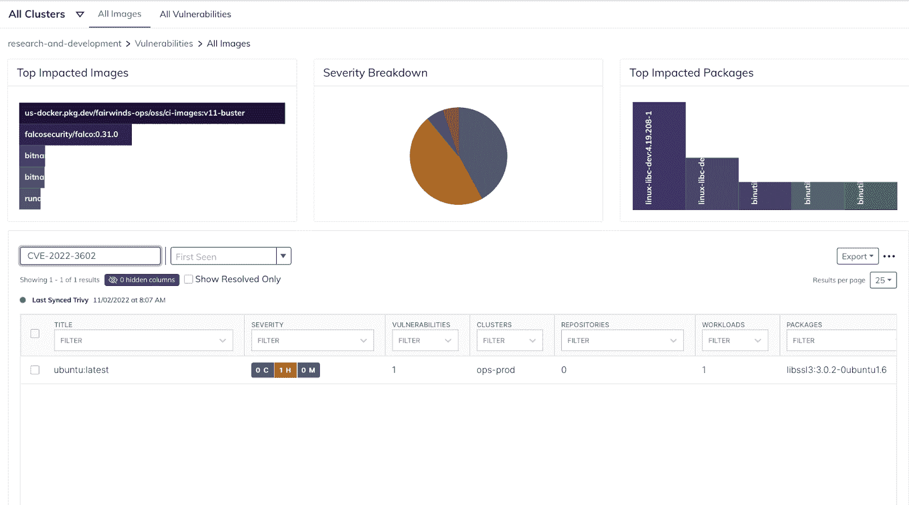

# CVE-2022-3602 和 CVE-2022-3786 OpenSSL 漏洞:扫描容器图像

> 原文：[https://www.fairwinds.com/blog/cve-2022-3602-and-cve-2022-3786-openssl-vulnerabilities-scanning-container-images#2022-11-30](https://www.fairwinds.com/blog/cve-2022-3602-and-cve-2022-3786-openssl-vulnerabilities-scanning-container-images#2022-11-30)

 2022 年 11 月 1 日，OpenSSL [公布了 OpenSSL 3 . 0 . 0-3 . 0 . 6 版本中的](https://www.openssl.org/news/secadv/20221101.txt) 一对高严重性漏洞。该漏洞是一种缓冲区溢出，需要一组非常特殊的环境才能被利用。在某些情况下，有可能远程执行代码。但是，需要注意的是:

这发生在证书链签名验证之后，并且要求 CA 已经对恶意证书进行了签名，或者要求应用程序继续进行证书验证，尽管未能构建到可信颁发者的路径。

由于这需要 OpenSSL 服务器的错误配置或滥用 CA 颁发的证书，因此大多数系统不太可能容易受到这种攻击。此外，许多操作系统中的缓冲区溢出保护将缓解该漏洞。

引用 Rapid7 的博客 中的 [:](https://www.rapid7.com/blog/post/2022/11/01/cve-2022-3786-and-cve-2022-3602-two-high-severity-buffer-overflows-in-openssl-fixed/)

对于这两种情况，这些类型的攻击都不太容易被广泛利用。

## 我如何发现哪些容器是易受攻击的？

尽管被利用的可能性很低，但建议用户更新到包含该修补程序的容器的最新版本。[fair winds Insights](//www.fairwinds.com/insights)，一个 Kubernetes 治理平台可以帮助识别任何容器映像中的漏洞。

确定您在 Fairwinds Insights 中的薄弱环节非常简单:

1.  导航到漏洞页面

2.  单击所有图像选项卡

3.  在搜索框中输入 CVE-2022-3602，然后按回车键

4.  受影响的图像列表将出现在表格中

如果你有兴趣了解 Fairwinds Insights 如何自动扫描容器漏洞， [联系](https://www.fairwinds.com/fairwinds-insights-demo) 。

