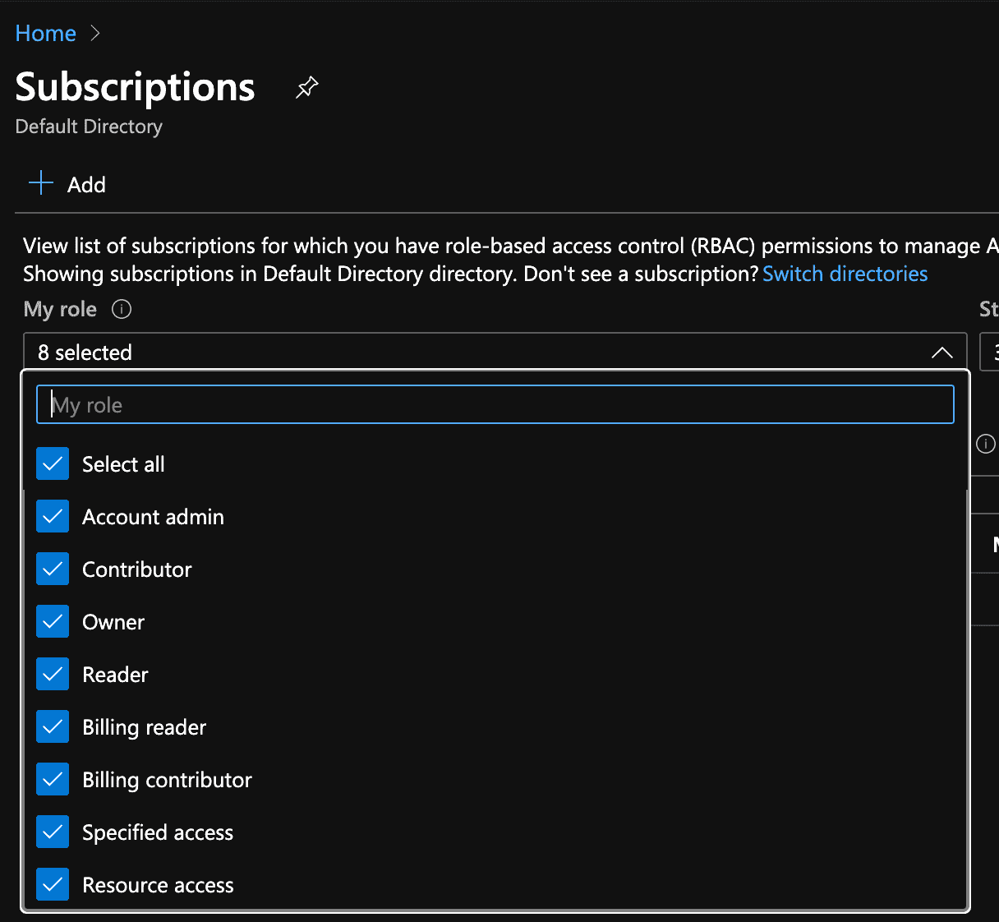

# Terraform 和 AKS 入门:部署第一个集群的分步指南

> 原文：[https://www.fairwinds.com/blog/getting-started-with-terraform-and-aks-a-step-by-step-guide-to-deploying-your-first-cluster#2022-12-12](https://www.fairwinds.com/blog/getting-started-with-terraform-and-aks-a-step-by-step-guide-to-deploying-your-first-cluster#2022-12-12)

 我们是使用基础设施作为代码来管理 Kubernetes 的主要倡导者。Terraform 是我们管理 Kubernetes 基础设施整个生命周期的首选工具。你可以在这里阅读关于 Terraform 的[好处](/blog/what-is-terraform-and-why-is-it-important)。

这篇博客提供了一个分步指南，介绍如何通过部署第一个以基础设施为代码的集群来开始使用 Terraform 和 AKS。

## **先决条件**

如果您想在 Terraform 中创建自己的 AKS 集群，请遵循以下步骤。

*   创建 Azure 帐户并登录(有一个免费层)。
*   创建订阅-确认订阅具有所有者权限



## **步骤**

为项目创建一个类似 `terraform-aks.` 的目录接下来，用这个命令在目录中设置一个 ssh 密钥对: `ssh-keygen -t rsa -f ./aks-key.` 然后，从命令行运行`az login`登录到你的 Azure 账户。

我们现在将设置几个 Terraform 文件来包含各种资源配置。第一个文件将被命名为 `provider.tf.` 创建文件并添加这几行代码:

```
provider "azurerm" {
  version = "~> 2.5.0"
  features {}
}

provider "azuread" {
  version = "0.9.0"
} 
```

现在，创建一个名为 `cluster.tf.` 的文件，这将包括我们的虚拟网络、集群和节点池模块。现在我们可以添加一个资源组，这是 Azure 创建资源所需要的。

```
## Create a resource group to place resources
resource "azurerm_resource_group" "aks" {
  name     = "myakscluster"
  location = "centralus"
} 
```

这段代码将为您的 AKS 集群设置网络，并将其添加到 `cluster.tf` 中。

```
## Create the virtual network for an AKS cluster
module "network" {
  source              = "git@github.com:FairwindsOps/azure-terraform-modules.git//virtual_network?ref=virtual_network-v0.6.0"
  region              = "centralus"
  resource_group_name = azurerm_resource_group.aks.name
  name                = "myakscluster"
  network_cidr_prefix = "10.64.0.0"
  network_cidr_suffix = 10
  subnets = [{
    name       = "aks-subnet"
    cidr_block = 16
  }]
} 
```

您会注意到在 `source` 字段中， `network` 模块正从我们的 git repo:[git @ github . com:FairwindsOps/azure-terraform-modules . git//virtual _ network 中拉出。](mailto:git@github.com:FairwindsOps/azure-terraform-modules.git//virtual_network.)

如果你浏览那个回购，在 `aks_cluster` 目录下，你会注意到 `aad.tf` 文件。这个模块支持 Azure Active Directory 集成，但是我们不会在这里使用它。您还可以看到该模块正在创建的所有其他资源。接下来，将这段代码添加到 AKS 集群本身的 `cluster.tf` 文件中:

```
## Create the AKS cluster
module "cluster" {
  source              = "git@github.com:FairwindsOps/azure-terraform-modules.git//aks_cluster?ref=aks_cluster-v0.8.0"
  region              = "centralus"
  cluster_name        = "myakscluster"
  kubernetes_version  = "1.16.10"
  resource_group_name = azurerm_resource_group.aks.name
  node_subnet_id      = module.network.subnet_ids[0] # use the subnet from the module above
  network_plugin      = "azure"
  network_policy      = "calico"
  public_ssh_key_path = "aks-key.pub"
} 
```

*注意:这里使用的是 Kubernetes 1.16.10。您可能需要查看 AKS 发行说明，以确认最新支持的版本。*

您会注意到某些值，如`module.network.subnet_ids[``0``],`是从 `network` 模块中引用的。Terraform 的这一特性使您能够在模块或资源上设置值，并在其他模块或资源上使用它们。最后，将这段代码添加到 `cluster.tf` 中，以设置包含 AKS 工作节点的节点池:

```
## Create the node pool
module "node_pool" {
  source         = "git@github.com:FairwindsOps/azure-terraform-modules.git//aks_node_pool?ref=aks_node_pool-v0.4.0"
  name           = "myakspool"
  kubernetes_version  = "1.16.10"
  aks_cluster_id = module.cluster.id
  node_subnet_id = module.network.subnet_ids[0]
} 
```

*注意:这里使用的是 Kubernetes 1.16.10。您可能需要查看 AKS 发行说明，以确认最新支持的版本。*

就是这样！你的地形文件已经准备好了。

下一步是通过运行 `terraform init.` 初始化 Terraform，Terraform 会生成一个名为 `.terraform` 的目录，并下载 `cluster.tf.` 中声明的各个模块源码

初始化将拉入这些模块所需的任何提供程序，在本例中，它将下载 `google` 提供程序。如果配置的话，Terraform 还会配置 `backend` 用于存储状态文件。

```
terraform init
Initializing modules...
Downloading git@github.com:FairwindsOps/azure-terraform-modules.git for cluster...
- cluster in .terraform/modules/cluster/aks_cluster
Downloading git@github.com:FairwindsOps/azure-terraform-modules.git for network...
- network in .terraform/modules/network/virtual_network
Downloading git@github.com:hashicorp/terraform-cidr-subnets.git?ref=v1.0.0 for network.subnet_addrs...
- network.subnet_addrs in .terraform/modules/network.subnet_addrs
Downloading git@github.com:FairwindsOps/azure-terraform-modules.git for node_pool...
- node_pool in .terraform/modules/node_pool/aks_node_pool

Initializing the backend...

Initializing provider plugins...
- Checking for available provider plugins...
- Downloading plugin for provider "azurerm" (hashicorp/azurerm) 2.5.0...
- Downloading plugin for provider "azuread" (hashicorp/azuread) 0.9.0...
- Downloading plugin for provider "kubernetes" (hashicorp/kubernetes) 1.11.3...
- Downloading plugin for provider "null" (hashicorp/null) 2.1.2...

The following providers do not have any version constraints in configuration,
so the latest version was installed.

To prevent automatic upgrades to new major versions that may contain breaking
changes, it is recommended to add version = "..." constraints to the
corresponding provider blocks in configuration, with the constraint strings
suggested below.

* provider.kubernetes: version = "~> 1.11"
* provider.null: version = "~> 2.1"

Terraform has been successfully initialized!

You may now begin working with Terraform. Try running "terraform plan" to see
any changes that are required for your infrastructure. All Terraform commands
should now work.

If you ever set or change modules or backend configuration for Terraform,
rerun this command to reinitialize your working directory. If you forget, other
commands will detect it and remind you to do so if necessary. 
```

成功初始化 Terraform 后，您应该能够运行 `terraform plan.` 在允许 Terraform 进行任何更改之前，运行 `terraform plan` 并检查输出总是一个好主意。

```
terraform plan
Refreshing Terraform state in-memory prior to plan...
The refreshed state will be used to calculate this plan, but will not be
persisted to local or remote state storage.

module.cluster.data.azurerm_subscription.current: Refreshing state...

------------------------------------------------------------------------

An execution plan has been generated and is shown below.
Resource actions are indicated with the following symbols:
  + create

Terraform will perform the following actions:

  # azurerm_resource_group.aks will be created
  + resource "azurerm_resource_group" "aks" {
      + id       = (known after apply)
      + location = "centralus"
      + name     = "myakscluster"
    }

  # module.cluster.azurerm_kubernetes_cluster.cluster will be created
  + resource "azurerm_kubernetes_cluster" "cluster" {
      + dns_prefix            = "myakscluster"
      + fqdn                  = (known after apply)
      + id                    = (known after apply)
      + kube_admin_config     = (known after apply)
      + kube_admin_config_raw = (sensitive value)
      + kube_config           = (known after apply)
      + kube_config_raw       = (sensitive value)
      + kubernetes_version    = "1.16.9"
      + location              = "centralus"
      + name                  = "myakscluster"
      + node_resource_group   = (known after apply)
      + private_fqdn          = (known after apply)
      + resource_group_name   = "myakscluster"
      + tags                  = {
          + "cluster-name"  = "myakscluster"
          + "created-by"    = "Terraform"
          + "module-source" = "github.com/FairwindsOps/azure-terraform-modules/aks_cluster"
        }

      + addon_profile {
          + aci_connector_linux {
              + enabled = false
            }

          + azure_policy {
              + enabled = false
            }

          + http_application_routing {
              + enabled                            = false
              + http_application_routing_zone_name = (known after apply)
            }

          + kube_dashboard {
              + enabled = false
            }
        }

      + default_node_pool {
          + availability_zones    = [
              + "1",
              + "2",
              + "3",
            ]
          + enable_auto_scaling   = true
          + enable_node_public_ip = false
          + max_count             = 10
          + max_pods              = 110
          + min_count             = 1
          + name                  = "default"
          + node_count            = 1
          + os_disk_size_gb       = 50
          + type                  = "VirtualMachineScaleSets"
          + vm_size               = "Standard_D2_v2"
          + vnet_subnet_id        = (known after apply)
        }
...
Plan: 4 to add, 0 to change, 0 to destroy. 
```

请注意，这段摘录已经过编辑，以缩减本文的篇幅。

如上例所示，Terraform 将采取行动添加我们的 4 AKS 资源。应用时，Terraform 将创建我们的网络、子网(用于 pod 和服务)、AKS 集群和节点池。

计划通过验证后，通过运行 `terraform apply.` 进行最后一个验证步骤来应用更改，Terraform 将再次输出计划并在应用前提示确认。完成此步骤大约需要 10 分钟。要与集群进行交互，请在终端中运行此命令。

```
az aks get-credentials --resource-group myakscluster --name myakscluster --admin 
```

然后，您应该能够 `kubectl get nodes` ，您将看到您的集群中有两个工作节点！

```
kubectl get nodes
NAME                                STATUS   ROLES   AGE     VERSION
aks-default-14693408-vmss000000     Ready    agent   8m24s   v1.16.9
aks-myakspool-14693408-vmss000000   Ready    agent   4m31s   v1.16.9 
```

恭喜您，您已经使用 Terraform 成功部署了 Kubernetes AKS 集群！您现在可以开始将您的应用程序部署到 Kubernetes 了！

## 资源